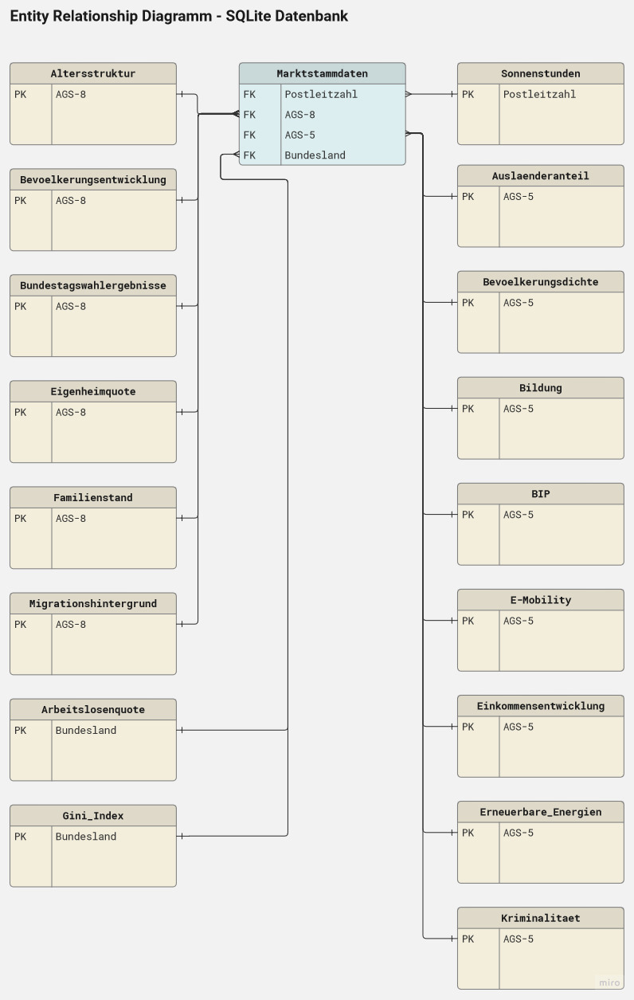

# Schlüsselfaktoren zur Steigerung des Photovoltaik-Ausbaus in Deutschland
## Motivation: 

Der Solarausbau in Deutschland spielt eine entscheidende Rolle bei der Erreichung des im novellierten Klimaschutzgesetz 2021 verankerten Ziels der Klimaneutralität bis zum Jahr 2045. 
Die vorliegende Arbeit untersucht den Zusammenhang sozioökonomischer Einflussfaktoren auf die Anzahl installierter Photovoltaik-Anlagen. Darüber hinaus wird die historische Entwicklung des Solarausbaus in Bezug zu temporalen Ereignissen und Einflussfaktoren betrachtet mit dem Ziel, die entscheidenden Dynamiken und Determinanten herauszuarbeiten, mögliche Problemfelder für den zukünftigen Solarausbau aufzuzeigen und Handlungsempfehlungen abzuleiten.

## Forschungsfragen:
**Forschungsfrage 1:** Welcher Kausalzusammenhang besteht zwischen sozi-oökonomischen Einflussfaktoren und der Anzahl errichteter PV-Anlagen in Deutschland?  
**Forschungsfrage 2:**  Welche temporalen Einflüsse erklären den Entwick-lungsverlauf des PV-Ausbaus in Deutschland zwischen 2000 und 2023?

## Jupyter Notebooks:  
Alle zum Projekt gehörigen Notebooks sind im 'main' Ordner zu finden (bitte chronologisch ausführen):    
01_ETL_DWH_Marktstammdaten.ipynb   
02_ETL_DWH_Soziooekonomische_Daten.ipynb   
03_ETL_DWH_Solar_Wetter_Daten.ipynb   
04_Zeitreihenanalyse.ipynb    
05_Regression.ipynb    
06_Entscheidungsbaum.ipynb    
07_Time_Series_Forecasting.ipynb   
08_Time_Series_Simulation.ipynb   
09_Time_Series_FINAL.ipynb      

## Primär verwendete Python Bibliotheken:   
Pandas, Numpy    
Matplotlib, Seaborn   
Geopy, Geopandas    
Sqlite3    
Statsmodels   
Sklearn    
  
Es werden zwei Environments benötigt, um die Notebooks auszuführen. Die entsprechenden Python Versionen folgende Python Versionen sind hier aufgeführt. Die benötigten Packages / Bibliotheken können über folgende, im Readme-Ordner hinterlegte Requirements-Dateien initialisiert werden:   
   
**Env 1**
- Python 3.11.4  
- requirements_env1.txt    
- für Notebook 01 bis 06 und 08 bis 09    
  
**Env 2** 
- Python 3.9.18 
- requirements_env2.txt      
- für Notebook 07  

## Data-Warehouse:
Name: dwh.sqlite3   
Speicherort: 'output' Ordner 

Darstellung der Relationen zwischen den Maktstammdaten und zugeordneten sozioökonomischen- und Wetterdaten.

  

Das Data-Warehouse dwh bildet die Datenbasis für die folgenden Analysen und erlaubt es, die jeweils benötigten Informationen per SQL-Abfrage zu selektieren und zusammenzuführen. Zusätzlich wird eine csv-Datei marktstd_full.csv im output-Ordner abgelegt, die neben den Markstammdaten alle erhobenen und den PV-Standorten zugeordneten sozioökonomischen, demo-grafischen und Wetter-Daten enthält. 

### Tabelle 01: marktstammdaten   
Im Marktstammdatenregister werden alle Stromerzeuger (Kraftwerke) Deutschlands aufgeführt, um Stromerzeugungskapazitäten zu erfassen. Davon werden alle Solar-Einheiten abgerufen:
3.173.010 Zeilen (= Anzahl registrierte PV-Anlagen)
Stand: 1.07.2023 

Data Cleaning:  
Nicht relevante Spalten oder Spalten mit sehr vielen NaN wurden gelöscht und der Datensatz wie folgt bereinigt:
- 7.078 Zeilen endgültig stillgelegte PV-Anlagen: gelöscht
- 23 Zeilen mit PV-Anlagen außerhalb Deutschlands: gelöscht
- 2 Zeilen mit fehlenden Standort-Angaben gelöscht
- 198 Zeilen enthielten ungültige Postleitzahlen. Diese wurden recherchiert und berichtigt.
- 56.661 fehlende Werte für Inbetriebnahmedatum wurden mit dem Registrierungsdatum aufgefüllt.
- 45.579 fehelnde Werte in FernsteuerbarkeitNb wurden entsprechend ihrem vorliegenden Verhältnis aufgefüllt.
- 25.860 fehelnde Werte in Einspeisungsart wurden entsprechend ihrem vorliegenden Verhältnis aufgefüllt.
- 3.301 fehlende Werte in ZugeordneteWirkleistungWechselrichter wurden durch den Durchschnitt ersetzt.
- 75.515 fehelnde Werte in GemeinsamerWechselrichterMitSpeicher wurden entsprechend ihrem vorliegenden Verhältnis aufgefüllt.
- 84.607 fehlende Werte in AnzahlModule wurden durch den Durchschnitt ersetzt.
- 57 fehlende Werte in Lage wurden durch die am häufigsten vorkommenden 4 Werte entsprechend ihres Verhältnisses aufgefüllt.
- 85.214 fehlende Werte in Leistungsbegrenzung wurden durch die am häufigsten vorkommenden 3 Werte entsprechend ihres Verhältnisses aufgefüllt.
- 64.242 fehlende Werte in EinheitlicheAusrichtungUndNeigungswinkel wurden entsprechend ihrem vorliegenden Verhältnis aufgefüllt.
- 49.014 fehlende Werte in Hauptausrichtung wurden entsprechend ihrem vorliegenden Verhältnis aufgefüllt.
- 74.009 fehlende Werte in HauptausrichtungNeigungswinkel wurden entsprechend ihrem vorliegenden Verhältnis aufgefüllt.
- 408.138 fehlende Werte in Nutzungsbereich wurden entsprechend ihrem vorliegenden Verhältnis aufgefüllt.

Der bereinigte Datensatz enthält 3.173.010 Zeilen und 25 Spalten: 
- DatumLetzteAktualisierung (Datum der letzten Aktualisierung an diesem Objekt)
- NetzbetreiberpruefungStatus (Der Status der letzten Netzbetreiberprüfung, insofern eine durchgeführt wurde. Werte: 0 oder 1)
- AnlagenbetreiberMastrNummer (MaStR-Nummer des Betreibers, Mehrfachanmeldung mit bis zu 781 Anlagen enthalten)
- Bundesland
- Landkreis
- Gemeinde
- AGS-8 (8-stelliger Gemeindeschlüssel)
- Postleitzahl
- Ort
- Registrierungsdatum
- Inbetriebnahmedatum
- EinheitBetriebsstatus (In Planung, In Betrieb, Vorübergehend stillgelegt)
- Bruttoleistung (in kWh)
- FernsteuerbarkeitNb (Fernsteuerbarkeit der Einheit durch einen Netzbetreiber)
- Einspeisungsart (Volleinspeisung oder Teileinspeisung einschließlich Eigenverbrauch)
- GemeinsamerWechselrichterMitSpeicher (Stromspeicher vorhanden - gemeinsamer Wechselrichter, Stromspeicher vorhanden - kein gemeinsamer Wechselrichter, Kein Stromspeicher vorhanden)
- ZugeordneteWirkleistungWechselrichter (Leistung  die typischerweise im Netz oder in der Kundenanlage „ankommt“.)
- AnzahlModule (Anzahl der Module dieser Stromerzeugungseinheit)
- Lage (Errichtungsort der Stromerzeugungseinheit: Freifläche, Bauliche Anlagen (Hausdach, Gebäude und Fassade), Bauliche Anlagen (Sonstige), Steckerfertige Erzeugungsanlage, Gewässer, Großparkplatz)
- Leistungsbegrenzung (Nein, Ja (70%), Ja (60%), Ja (50%), Ja, (Sonstige))
- EinheitlicheAusrichtungUndNeigungswinkel (0 / 1)
- Hauptausrichtung (Nord, Nord-Ost, Ost, Süd-Ost, Süd, Süd-West, West, Nord-West, nachgeführt, Ost-West)
- HauptausrichtungNeigungswinkel (Fassadenintegriert, >60 Grad, 40-60 Grad, 20-40 Grad, <20 Grad, Nachgeführt)
- Nutzungsbereich (Haushalt, Gewerbe, Indistrie, Landwirtschaft, Öffentliches Gebäude, Sonstige)
- AGS-5 (5-stelliger Gemeindeschlüssel)

### Tabelle 02: altersstruktur 
Die Tabelle gibt Auskunft über die Alterverteilung in der jeweiligen Gemeinde in Prozent. (Zensus 2011)
77.510 fehlende Werte wurden durch die des nächstgelegenen AGS-8 (Zahlenwert) ergänzt.

- AGS-8 (Primary Key)
- Unter 3 Jahre
- 3 bis 5 Jahre
- 6 bis 9 Jahre
- 10 bis 15 Jahre
- 16 bis 18 Jahre
- 19 bis 24 Jahre
- 25 bis 39 Jahre
- 40 bis 59 Jahre
- 60 bis 66 Jahre
- 67 bis 74 Jahre
- 75 Jahre und älter

### Tabelle 03: arbeitslosenquote
Die Tabelle zeigt die Arbeitlosenquote im Jahr 2022 je Bundesland in Prozent. (GovData)

- Bundesland
- Arbeitslosenquote_%

### Tabelle 04: auslaenderanteil
Die Tabelle zeigt den Ausländeranteil pro Gemeinde in Prozent (Deutschlandatlas 2021)

- AGS-5
- Auslaender_%

### Tabelle 05: bevoelkerungsdichte
Die Tabelle gibt bezogen auf den 5-stelligen Amtlichen Gemeindeschlüssel an, welche Fläche das Gebiet hat, wieviele Menschen dort leben und wie hoch die Bevölkerungszahl pro qm ist. (DeStatis, 2021)

- AGS-5
- Fläche km2
- Bevölkerung
- Bevölkerung pro km2

### Tabelle 06: bevoelkerungsentwicklung
Die Tabelle gibt an, wie sich die Bevölkerungszahlen zwischen 2016 und 2021 verändert haben, in Prozent, bezogen auf den 8-stelligen Amtlichen Gemeindeschlüssel. (Deutschlandatlas)
7.993 fehlende Werte wurden durch die des nächstgelegenen AGS-8 (Zahlenwert) ergänzt.

- AGS-8
- Bev_Entwicklung_%

### Tabelle 07: bildung
Die Tabelle gibt bezogen auf den 5-stelligen Amtlichen Gemeindeschlüssel an, welche Schulabschlüsse die Beschäftigten haben wie hoch der Anteil der Schulabgänger ohne Hauptschulabschluss ist, jeweils in Prozent. (Deutschlandatlas 2021)

- AGS-5
- bquali_unifh  (akademischen Abschluss)
- bquali_mabschl  (anerkannter Berufsabschluss / ohne akademischen Abschluss)
- bquali_oabschl  (ohne einen Berufs-/akademischen Abschluss)
- schule_oabschl  (Schulabgänger/-innen ohne Hauptschulabschluss)

### Tabelle 08: bip
Die Tabelle enthält das Bruttoinlandsprodukt bezogen auf den 5-stelligen Amtlichen Gemeindeschlüssel. (Deutschlandatlas, 2021)

- AGS-5
- BIP

### Tabelle 09: bundestagswahlergebnisse
Die Tabelle enthält die Erbebnisse der Bundestagswahlen 2021 bezogen auf den 8-stelligen Amtlichen Gemeindeschlüssel in Prozent.
653 fehlende Werte wurden durch die des numerisch nächstgelegenen AGS-8 ergänzt.

- AGS-8
- CDU_Prozent
- SPD_Prozent
- AfD_Prozent
- FDP_Prozent
- DIE LINKE_Prozent
- GRÜNE_Prozent
- CSU_Prozent
- FREIE WÄHLER_Prozent
- Die PARTEI_Prozent
- Tierschutzpartei_Prozent
- NPD_Prozent
- PIRATEN_Prozent

### Tabelle 10: e-mobility
Die Tabelle gibt Auskunft über die Verbreitung von E-Autos und Ladestationen bezogen auf den 5-stelligen Amtlichen Gemeindeschlüssel. (Deutschlandatlas, 2022)

- AGS-5
- eLade  (Öffentlich zugängliche Ladepunkte für E-Autos je 100.000 Einwohner)
- eAuto   (Anteil von Pkw mit reinem Elektroantrieb an allen Pkw in Prozent) 

### Tabelle 11: eigenheimquote
Die Tabelle enthält die Eigenheimquote in Prozent (Anteil der von Eigentümerinnen und Eigentümern selbst bewohnten Wohnungen an allen bewohnten Wohnungen in Wohngebäuden) bezogen auf den 8-stelligen Amtlichen Gemeindeschlüssel. (Zensus 2011)
892 fehlende Werte, davon die meisten AGS-8 in Mecklenburg-Vorpommern. Daher wurden die fehlenden Werte mit dem Durchschnittswert für Mecklenburg-Vorpommern von 49,5% ersetzt.

- AGS-8
- Eigentum_%

### Tabelle 12: einkommensentwicklung
Die Tabelle zeigt die Entwicklung des verfügbaren Einkommens der privaten Haushalte bezogen auf den 5-stelligen Amtlichen Gemeindeschlüssel von 1995 bis 2020 auf. Das durchschnittliche Einkommen berechnet sich aus dem Primäreinkommen, dem monetäre Sozialleistungen und sonstigen laufenden Transfers hinzugefügt werden; abgezogen werden Einkommen- und Vermögensteuern, Sozialbeiträge und sonstige laufende Transfers, die von den privaten Haushalten zu leisten sind. (Statistikportal)

- AGS-5
- Jahreszahlen von 1995 bis 2020

### Tabelle 13: erneuerbare_energien
Die Tabelle gibt Aufschluss darüber, wie hoch der Anteil fertiggestellter Wohnungen mit primär erneuerbarer Heizenrgie an allen in 2021 errichteten Wohnungen war. Zudem schafft es eine Vergleichbarkeit der Neubau-Aktivitäten in 2021 bezogen auf den 5-stelligen Amtlichen Gemeindeschlüssel. (Deutschlandatlas)

- AGS-5
- Wohnen_EZFH (Fertiggestellte Wohnungen in neuen Ein-und Zweifamilienhäusern je 10.000 Einwohner in 2021)
- Wohnen_MFH (Fertiggestellte Wohnungen in neuen Mehrfamilienhäusern je 10.000 Einwohner in 2021) 
- Heizung_Erneuerbare_% (Anteil fertiggestellter Wohnungen mit primär erneuerbarer Heizenergie an allen errichteten Wohnungen in 2021)

### Tabelle 14: familienstand
Die Tabelle gibt Auskunft über den Familienstand in Prozent bezogen auf den 5-stelligen Amtlichen Gemeindeschlüssel. (Zensus 2011)
892 fehlende Werte wurden durch die des nächstgelegenen AGS-8 (Zahlenwert) ergänzt.

- AGS-8
- Ledig_Prozent
- Verheiratet/Eingetr. Lebenspartnerschaft_Prozent
- Geschieden/Eingetr. Lebenspartnerschaft aufgehoben_Prozent
- Verwitwet/Eingetr. Lebenspartner/-in verstorben_Prozent
- Ohne Angabe_Prozent

### Tabelle 15: gini_index
Die Tabelle gibt Auskunft über den Gini-Koeffizient bezogen auf das Bundesland in 2023. Der Gini-Koeffizient oder Gini-Index ist ein Maß der relativen Konzentration beziehungsweise Ungleichheit und kann einen Wert zwischen Null und Eins annehmen. Im Falle der Gleich­verteilung ergibt sich für den Gini-Koeffizienten ein Wert von Null und im Falle der Konzentration des gesamten Einkommens auf nur eine Person ein Wert von 1. (Statistikportal)

- Bundesland
- Gini_Index

### Tabelle 16: kriminalitaet
Die Tabelle enthält die Anzahl aller Straftaten sowie speziell Wohnungseinbruchdiebstahl-Delikte bezogen auf den 5-stelligen Amtlichen Gemeindeschlüssel in 2020. (Deutschlandatlas)

- AGS-5
- Straftaten (Straftaten gesamt pro 100.000 Einwohner in 2020)
- Einbruch (Wohnungseinbruchdiebstahl pro 100.000 Einwohner in 2020)

### Tabelle 17: migrationshintergrund
Die Tabelle gibt Auskunft über den Migrationshintergrund der Bevölkerung in Prozent bezogen auf den 8-stelligen Amtlichen Gemeindeschlüssel (Zensus, 2011)  
9.567 fehlende Werte wurden durch die des nächstgelegenen AGS-8 (Zahlenwert) ergänzt.

- AGS-8
- Deutsche mit beidseitigem Migrationshintergrund_Prozent
- Deutsche mit einseitigem Migrationshintergrund_Prozent
- Ausländer/-innen mit eigener Migrationserfahrung_Prozent
- Ausländer/-innen ohne eigene Migrationserfahrung_Prozent
- Deutsche mit eigener Migrationserfahrung_Prozent
- Deutsche ohne eigene Migrationserfahrung_Prozent
- Ausländer/-innen_Prozent
- Deutsche mit Migrationshintergrund_Prozent
- Personen mit Migrationshintergrund_Prozent
- Personen ohne Migrationshintergrund_Prozent

### Tabelle 18: sonnenstunden_plz
Um jeder Solaranlagen die Anzahl Sonnenstunden zuzuweisen, wird dem Centroid des Postleitzahlengebietes mittels Haversine Distance Equation Längen- und Breitengrad der jeweils nächstgelegenen Wetterstation zugeordnet. Die Tabelle enthält die jährlichen Sonnenstunden bezogen auf die Postleitzahl. (Opendata DWD)

- Postleitzahl
- Sonnenstunden

### Tabelle 19: entwicklung_pv
Die Tabelle zeigt die Entwicklung des Anteils von Photovoltaik an der Brutto-Stromerzeugung in Deutschland zwischen 2002 und 2022. (Statista)

- Jahr
- % Anteil

### Tabelle 20: strompreis
Die Tabelle zeigt die Entwicklung der Strom-Verbraucherpreise (in Ct pro kWh inkl. MwSt.) in Deutschland zwischen 2000 und 2023. (BDEW, BMWK)

- Jahr
- Strom_Verbraucherpreis (in ct pro kWh inkl. MwSt)

### Tabelle 21: einspeiseverguetung
Die Tabelle zeigt die Entwicklung der Einspeisevergütung für neu installierte kleine PV-Anlagen zwischen 2000 und 2023. Bis 2012 wurde die Einspeisevergütung für kleine, in privaten Haushalten gebräuchlichen PV-Anlagen bis 30kW Leistung in einer Maßzahl zusammengefasst. Seit April 2012 wird zwischen Anlagen bis 10kW und Anlagen über 10 bis 40kW unterschieden. Um die durchschnittliche Entwicklung der Einspeisevergütung für kleine Anlagen zu beurteilen, wurde für die Werte ab 04/2012 der Mittelwert gebildet. (Bundesnetzagentur, SFV, LfL Bayern)

- Datum
- Einspeiseverguetung_kleine_PV_Anlagen (in ct pro kWh)

### Tabelle 22: e-mobility
Die Tabelle beeinhaltet Daten zur Anzahl Ladesäulen und zum Anteil von Elektroautos im Jahr 2022. (Deutschlandatlas)

- AGS-5
- eAuto (Anteil von Pkw mit reinem Elektroantrieb an allen Pkw zum 01.01.2022 in %)
- eLade (öffentlich zugängliche Ladepunkte für E-Autos zum 01.10.2022 je 100.000 Einwohner)

### Tabelle 23: erneuerbare_energien
Die Tabelle enthält Daten darüber, wieviele neue Wohnungen in 2021 in einem Gebiet errichtet wurden und welcher Anteil davon mit primär erneuerbaren Heizenergie ausgestattet wurde. (Deutschlandatlas)

- AGS-5
- Wohnen_EZFH (Fertiggestellte Wohnungen in neuen Ein-und Zweifamilienhäusern je 10.000 Einwohner in 2021)
- Wohnen_MFH (Fertiggestellte Wohnungen in neuen Mehrfamilienhäusern je 10.000 Einwohner in 2021)
- Heizung_Erneuerbare_% (Anteil fertiggestellter Wohnungen mit primär erneuerbarer Heizenrgie an allen errichteten Wohnungen in 2021 in %)

### Tabelle 24: eeg_umlage
Die EEG-Umlage dient der Förderung erneuerbarer Energien nach dem Erneuerbare-Energien-Gesetz. Sie ist Teil des Strompreises und stellt die Differenzkosten zwischen dem Marktpreis für Strom und dem Fördersatz für erneuerbare Energieträger dar. (Statista, Enercity, Rewag)

- Datum
- Euro-Cent pro kWh

### Tabelle 25: pv_kosten
Die Tabelle enthält die durchschnittlichen Kosten pro installiertem kWp (Kilowatt-Peak) zwischen 2000 und 2023 in Euro. Unter kWp wird die theoretisch größtmögliche Leistung (Nennleistung) einer Photovoltaikanlage unter Idealbedingungen (Sonneneinstrahlung, Einfallswinkel, Temperatur) verstanden. Da für die Zeit vor 2006 keine PV-Preis-Daten verfügbar sind, wird die Preisentwicklung in den USA mit der in Deutschland interpoliert und gerundet. (Gruenes.Haus, OurWoldInData) 

- Jahr_Monat
- PV_Kosten_Euro_pro_kWp

### Tabelle 26: ereignisse
In der Tabelle wurden Ereinisse modelliert, die potenziell Einfluss auf den Solarausbau in Deutschland haben. Der Solardeckel trat im Juni 2012 in Kraft und begrenzt die Zahlung von Einspeisevergütung auf 52 Gigawatt intallierte Gesamtleistung, was restriktive jährliche Zubau-Raten nach sich zog. Im Juni 2020 wurde die Deckelung aufgehoben.    
Die Nuklear-Katastrophe in Fukushima ereignete sich im März 2011. Sie bewirkte eine nachhaltige Abkehr von Atomkraft und eine Energiewende zugunsten erneuerbarer Energien in Deutschland.     
Der Ukraine-Krieg und die resultierenden Sanktionen gegen Russland lösten eine  Energiekrise aus und sorgten in 2022 für sprunghaft steigende Energiekosten, was zur verstärkten Förderung der erneuerbaren Energien beitrug. (Energiechronik, LPB-BW, Wirtschaftsdienst)    
Der Effekt des jeweiligen Ereignisses wurde mit 0 (keine Wirkung) oder 1 (Auswirkungen) kodiert.

- Datum
- Fukushima
- Ukrainekrieg
- Solardeckel

### Tabelle 27: marktstammdaten_2023
Im Marktstammdatenregister werden alle Stromerzeuger (Kraftwerke) Deutschlands aufgeführt, um Stromerzeugungskapazitäten zu erfassen. Davon werden alle Solar-Einheiten abgerufen:
3.722.267  Zeilen (= Anzahl registrierte PV-Anlagen)
Stand: 31.12.2023 

Data Cleaning:  
Für die Time Series Analysen nicht relevante Spalten wurden gelöscht und der Datensatz wie folgt bereinigt:
- 10.989 Zeilen endgültig stillgelegte PV-Anlagen: gelöscht
- 30 Zeilen mit PV-Anlagen außerhalb Deutschlands: gelöscht
- 59.034 fehlende Werte für Inbetriebnahmedatum wurden mit dem Registrierungsdatum aufgefüllt.
- 25.298 fehlende Werte in Einspeisungsart wurden nach bevorzugt genutzter Einspeisungsart aufgefüllt (vor 2012 Volleinspeisung, nach 2012 Teileinspeisung)
- 56 fehlende Werte in Lage wurden durch den am häufigsten vorkommenden Wert 853 Bauliche Anlagen (Hausdach, Gebäude und Fassade) ersetzt.

Der bereinigte Datensatz enthält 3.722.267 Zeilen und 5 Spalten: 

- Inbetriebnahmedatum
- AnlagenbetreiberMastrNummer
- Bruttoleistung
- Einspeisungsart
- Lage

## Original Datensätze: 
Speicherort: 'input' Ordner

## Dokumentationen zu den Original-Dateien: 
Speicherort: 'docs' Ordner

